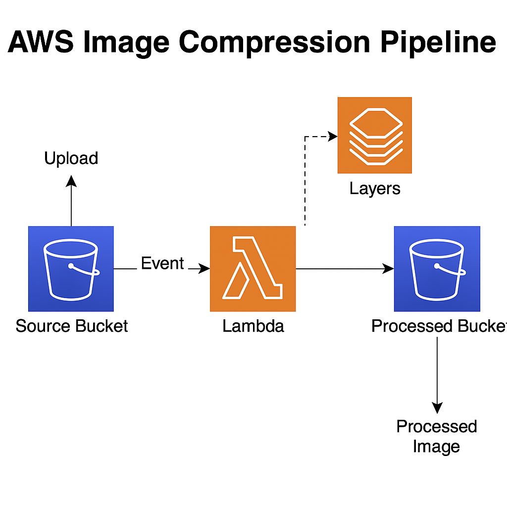

# AWS Serverless Image Compression Pipeline

This project showcases a fully serverless image compression pipeline built entirely using AWS services via the AWS Console. It demonstrates how to use S3, Lambda, IAM, and Lambda Layers to automate image resizing and quality reduction when a new image is uploaded to a source bucket.

## 📌 Project Overview

1. User uploads an image to **S3 Source Bucket**.
2. This triggers a **Lambda Function**.
3. Lambda:
   - Uses **Pillow** (via Lambda Layer) to compress image
   - Uploads result to **S3 Processed Bucket**

## 🧰 AWS Services Used

- Amazon S3 (source & processed buckets)
- AWS Lambda (event-driven function)
- Lambda Layers (Pillow library)
- IAM (role-based permissions)
- Python

## 📸 Architecture Diagram



## 🧠 Highlights

- Fully event-driven
- Uses Lambda Layer for image processing
- Created entirely via AWS Console
- Uses IAM for secure permissions

## 🐍 Lambda Function Code

See [`lambda-code.py`](./lambda-code.py) for the full Python code used to compress images using Pillow inside AWS Lambda.


## 🧾 IAM Policy Example

```json
{
  "Version": "2012-10-17",
  "Statement": [
    {
      "Effect": "Allow",
      "Action": ["s3:GetObject", "s3:PutObject"],
      "Resource": [
        "arn:aws:s3:::source-bucket-name/*",
        "arn:aws:s3:::processed-bucket-name/*"
      ]
    }
  ]
}
